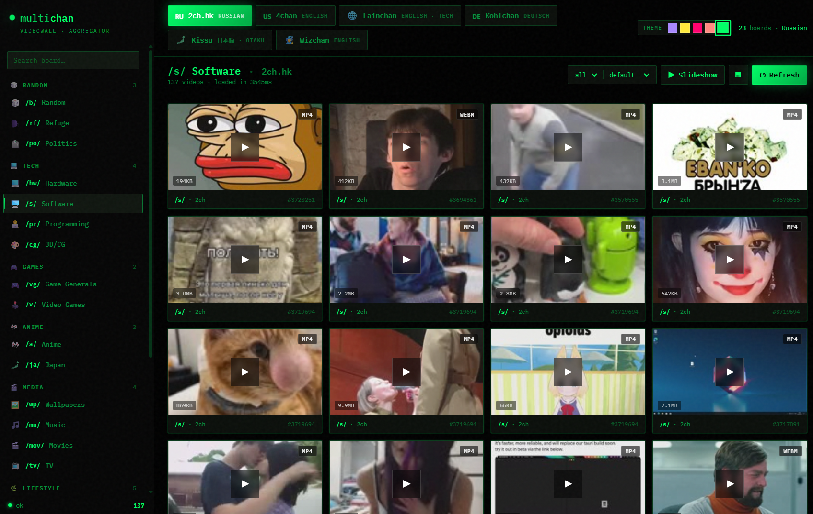
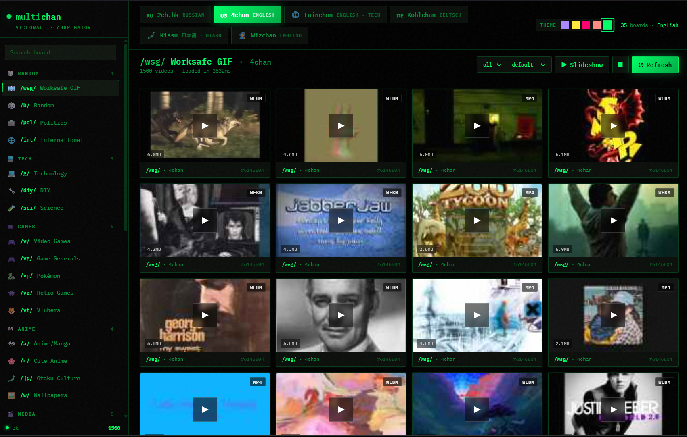
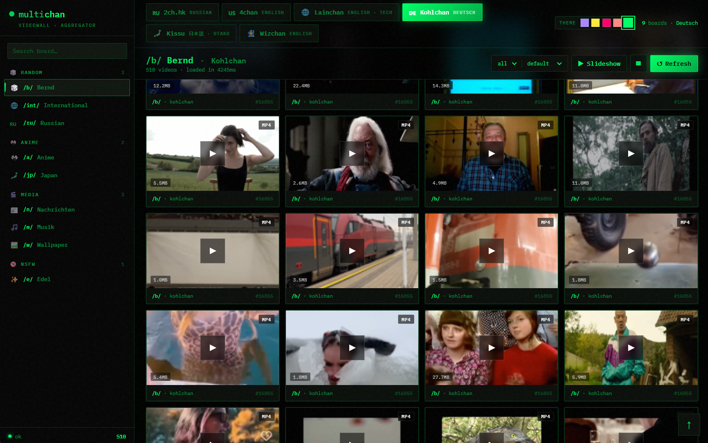

# 🎞️ Multichan Video Wall

> Desktop & web video aggregator for imageboards. Streams **mp4 / webm** from threads on **2ch.hk · 4chan · lainchan · kohlchan (krautchan) · kissu.moe · wizchan** through a unified UI with **5 themes** and **light / dark modes**.

[](LICENSE)
[](https://www.electronjs.org/)
[](https://nodejs.org/)
[]()

| 🇷🇺 2ch.hk · /s/ | 🇺🇸 4chan · /wsg/ | 🇩🇪 Kohlchan · /b/ |
|---|---|---|
|  |  |  |

---

## ✨ Features

- 🌐 **6 imageboards** out of the box: `2ch.hk` · `4chan` · `lainchan` · `kohlchan/krautchan` · `kissu.moe` · `wizchan` — **90+ boards** total
- 🎨 **5 themes** with one-click switcher:
  - **Terminal Hacker** (default) — green-on-black CRT vibes
  - **Glass Cathedral** — frosted glassmorphism with violet/cyan glows
  - **Brutalist Mono** — pure black/white, JetBrains Mono ALL CAPS
  - **Cyberpunk Neon** — pink + cyan neon borders with scanlines
  - **Soft Pastel** — light mode, cream background, Notion-style
- 📺 **In-grid hover preview** + full modal player with keyboard shortcuts
- 🔁 **Always fresh** — no server-side cache, every request hits the source. New uploads visible immediately
- 📦 **Compact / Comfy** density toggle — 4 or 6 columns, your call
- 🔉 **Volume & mute persist** — survives between videos and reloads
- ⌨️ **Keyboard navigation** — `←→` for prev/next, `Space` for pause, `F` for fullscreen, `M` for mute, `Esc` to close
- 🎬 **Slideshow mode** — auto-advance every 8 seconds
- 🔍 **Board search & category grouping** in sidebar
- 💾 **Direct download** — proxy serves `Content-Disposition: attachment` on `?dl=1`
- 📲 **PWA installable** + standalone Electron desktop app
- 🚀 **Self-hosted, single binary** — no signups, no telemetry, no ads, no cloud

---

## 📥 Installation

### Option 1: Download `.exe` (Windows, easiest)

Grab the latest from [**Releases**](https://github.com/shigio-labs/multichan-videowall/releases):

| File | What it does |
|---|---|
| `VideoWall-x.y.z-portable.exe` | Single self-contained file. Double-click → works. No install, no registry. Put on a USB stick if you want |
| `VideoWall-x.y.z-x64.exe` | NSIS installer. Installs to `Program Files`, makes Start Menu + Desktop shortcuts |

> **Note:** Windows Defender SmartScreen may warn on first launch (the `.exe` isn't code-signed — code-signing certs cost $200+/yr). Click **More info → Run anyway**.

### Option 2: Run from source

```bash
git clone https://github.com/shigio-labs/multichan-videowall.git
cd multichan-videowall
npm install
npm start                    # web mode → http://localhost:3000
npm run electron             # desktop mode (Electron window)
npm run dist                 # build .exe yourself (portable + installer)
```

Requires **Node.js 20+**.

---

## 🎯 Supported imageboards

| Site | Lang | Type | Boards | Notable |
|---|---|---|---|---|
| **[2ch.hk](https://2ch.hk/)** | 🇷🇺 Russian | Makaba | 23 | `/b/`, `/vg/`, `/mu/`, `/mov/`, `/a/`, `/spc/`, `/cg/`… |
| **[4chan](https://4chan.org/)** | 🇺🇸 English | 4chan API | 35 | `/wsg/`, `/gif/`, `/v/`, `/a/`, `/jp/`, `/wsg/`, `/sp/`… |
| **[lainchan](https://lainchan.org/)** | 🌐 English (tech) | vichan | 11 | `/λ/`, `/Ω/`, `/tech/`, `/sec/`, `/cyb/`… |
| **[kohlchan](https://krautchan.org/)** | 🇩🇪 Deutsch | LynxChan | 9 | `/b/` (Bernd), `/int/`, `/ru/`, `/a/`, `/jp/`… |
| **[kissu.moe](https://kissu.moe/)** | 🗾 日本語/Otaku | vichan | 5 | `/qa/`, `/jp/`, `/ec/`, `/spg/` |
| **[wizchan](https://wizchan.org/)** | 🧙 English | vichan | 7 | `/wiz/`, `/dep/`, `/jp/`, `/lounge/`… |

Boards are grouped by category in the sidebar: **Random / Tech / Games / Anime / Media / Lifestyle / Adult**.

### Adding more sites

The architecture is adapter-based. Adding a new imageboard = one config entry in `server.js`:

```javascript
"mychan": {
  id: "mychan",
  name: "Mychan",
  lang: "English",
  flag: "🌐",
  bases: ["https://mychan.example"],
  fetcher: "vichan",     // or "4chan", "dvach", "lynxchan"
  boards: [
    { id: "b", title: "Random", icon: "🎲", category: "random" },
  ],
}
```

If the site uses a totally different API, you can add a custom fetcher next to `fetchVichan` / `fetch4chan` / `fetchDvach` / `fetchLynxchan`.

---

## 🎨 Themes

Switch via the dot row in the top-right corner. Choice persists in `localStorage`.

| ID | Name | Vibe |
|---|---|---|
| 1 | Glass Cathedral | Premium dark navy + violet/cyan glassmorphism |
| 2 | Brutalist Mono | Pure black/white + yellow accent, JetBrains Mono ALL CAPS |
| 4 | Cyberpunk Neon | 80s sci-fi neon, hot pink + cyan, scanlines |
| 5 | Soft Pastel | Light mode, cream/peach, Notion-style |
| 6 | Terminal Hacker (default) | Green-on-black CRT, IBM Plex Mono |

---

## 🛠 Architecture

```
┌─────────────┐     ┌──────────────┐     ┌─────────────┐
│   Browser   │────▶│ Express API  │────▶│ Imageboards │
│   (or PWA)  │◀────│ + media proxy│◀────│ (JSON APIs) │
└─────────────┘     └──────────────┘     └─────────────┘
       ▲                    ▲
       │                    │
   ┌───┴────┐         ┌─────┴────┐
   │Electron│         │  Adapter │
   │ window │         │ per site │
   └────────┘         └──────────┘
```

- **`server.js`** — Express server with 4 fetcher adapters (`vichan`, `4chan`, `dvach`, `lynxchan`), `/api/sites`, `/api/snapshot`, `/proxy`. ~400 lines.
- **`electron/main.cjs`** — Boots the embedded server on a free port, opens BrowserWindow.
- **`public/`** — Vanilla JS frontend (no framework). `app.js` ~400 lines, `styles.css` ~600 lines (themes + responsive).

The proxy layer:
- Streams media chunks (supports HTTP `Range` for video seeking)
- Whitelist-only (only allowed imageboard CDNs go through)
- Sends correct `Referer` per upstream domain (some imageboards refuse without it)

---

## ⌨️ Keyboard shortcuts

| Key | Action |
|---|---|
| `←` / `→` | Previous / next video in modal |
| `Space` | Play / pause |
| `F` | Fullscreen |
| `M` | Mute / unmute (persists) |
| `Esc` | Close modal |

---

## ⚖️ Disclaimer

> **This software is a viewer / aggregator. It does not host, store, or modify any content. All media files are streamed directly from third-party imageboards listed above through a server-side proxy purely for CORS and `Referer` reasons.**
>
> - The author **does not own, operate, or moderate** any of the linked imageboards
> - The author **is not affiliated** with 2ch.hk, 4chan, lainchan, kohlchan, krautchan, kissu.moe, wizchan, or any of their operators
> - **No content is mirrored or cached** server-side. Every request hits the upstream live; turn off the app — content is gone
> - The **content posted on those imageboards is created and moderated (or not moderated) by their respective communities and operators**, not by this project
> - Some boards contain **NSFW / 18+ material** (clearly labelled with the `🔞` icon and grouped under the "18+" category in the sidebar). By using this software you confirm you are **of legal age in your jurisdiction** to view such content
> - This software is provided **"AS IS"** under the [MIT License](LICENSE), **without warranty of any kind**. The author is **not responsible** for what you choose to view, download, or share through it
> - You are **solely responsible** for compliance with your local laws regarding internet content, copyright (DMCA / EUCD / etc.), and age-restricted material
> - If you are a content owner and want a specific URL blocked from the proxy whitelist, **contact the upstream imageboard** — this tool does not host the file

This project is intended for **personal, private use** of legal-age individuals interested in browsing publicly available imageboard media efficiently. **Do not use it on shared / public computers** if your jurisdiction restricts access to such content.

---

## 🤝 Contributing

PRs welcome, especially for:

- **New imageboard adapters** (any site with a JSON-style thread API)
- **Bug fixes** (broken boards, dead mirrors)
- **New themes** (just add a `[data-theme="N"]` block in `styles.css` + entry in `THEMES` array in `app.js`)
- **Translations** of the UI

For new boards: please run `npm start` and verify with `curl http://localhost:3000/api/snapshot?site=YOURSITE&board=YOURBOARD` before submitting.

---

## 📜 License

[MIT](LICENSE) © shigio-labs

---

## 🔗 Related projects

- [yt-dlp](https://github.com/yt-dlp/yt-dlp) — universal video downloader (different scope, but kindred spirit)
- [4chan-x](https://github.com/ccd0/4chan-x) — userscript enhancing 4chan UX (browser-side)
- [hydrus](https://hydrusnetwork.github.io/hydrus/) — local media database / tagger (heavyweight)

---

<sub>Tags: `imageboard` · `4chan-downloader` · `2ch` · `lainchan` · `kohlchan` · `krautchan` · `kissu` · `wizchan` · `vichan` · `lynxchan` · `makaba` · `video-aggregator` · `electron` · `pwa` · `self-hosted` · `webm` · `mp4`</sub>
